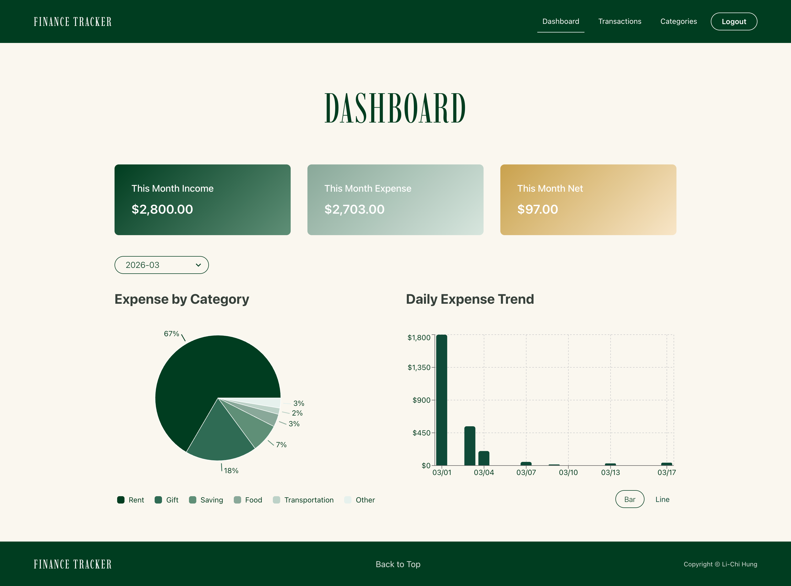
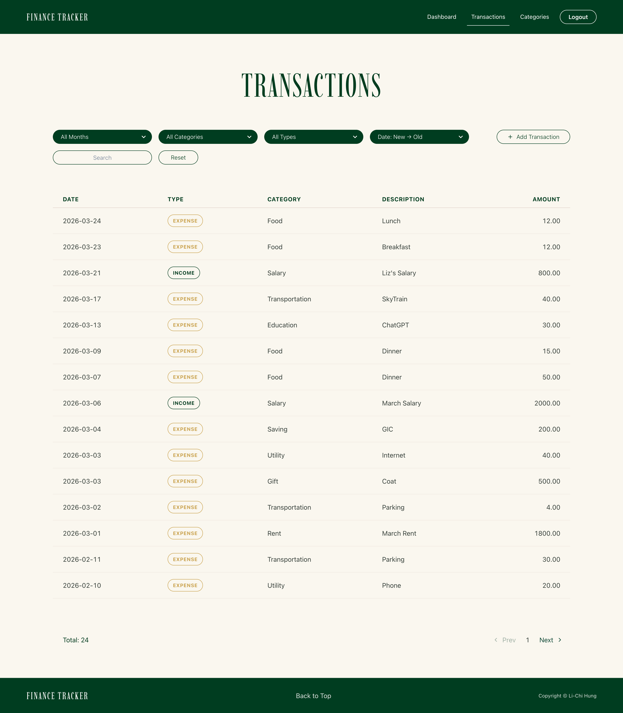
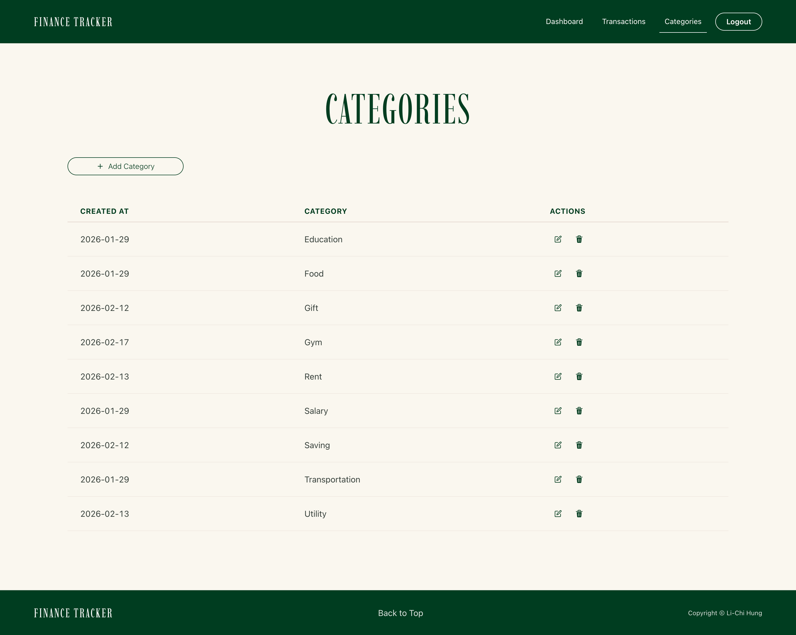

# Personal Finance Tracker

A full-stack personal finance web app to track income and expenses, built with React and Django REST API.

## Features

- User authentication (JWT login / register)
- Dashboard with expense overview and charts
- Transaction management (add, edit, delete)
- Category management
- Filtering and search
- Responsive UI (mobile friendly)

## Demo

Live Demo: https://lichihung-finance-tracker.netlify.app/

Backend API: https://personal-finance-tracker-edzo.onrender.com/api/


## Tech Stack

Frontend
- React
- Chakra UI
- React Router
- React Hook Form
- Recharts

Backend
- Django
- Django REST Framework
- JWT Authentication (SimpleJWT)

Deployment
- Frontend: Netlify
- Backend: Render

## Screenshots

### Dashboard


### Transactions


### Categories


## Run Locally

### Backend

```bash
cd backend
python -m venv .venv
source .venv/bin/activate
pip install -r requirements.txt
python manage.py migrate
python manage.py runserver
```

### Frontend

cd frontend
npm install
npm run dev

### Environment Variables

VITE_API_BASE_URL=http://127.0.0.1:8000/api